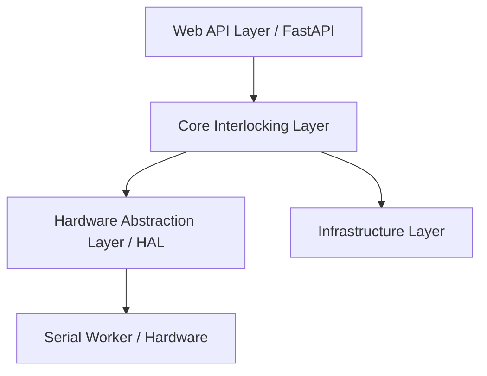

# PRDMS4 プロジェクト設計書

本ドキュメントでは、現在のPython版PRDMS4（Plarail Interlocking & Control System）の全体アーキテクチャおよび各コンポーネントの設計について整理します。

---

## 1. 全体アーキテクチャ

システムは主に以下の4つのレイヤーで構成されています。

### 各レイヤーの役割
1. **Web API Layer (`src/web`)**: FastAPIを使用したHTTP/WebSocketインターフェース。列車の運行管理（登録、スタブ設定）、各種インフラのステータス取得、手動操作用のタスク操作などを提供します。
2. **Core Interlocking Layer (`src/core`)**: 鉄道工学の連動システム（Interlocking）を模した安全制御層。区間（`Place`）の専有管理、ポイント（`TwoWayPoint`）やストップレール（`StopRail`）の連動制約を処理します。
3. **Hardware Abstraction Layer (`src/hal`)**: 実デバイス（ESP32等のコントローラ）とのやり取りを抽象化するレイヤー。コマンドの送信やセンサーからの信号通知を処理します。
4. **Infrastructure Layer (`src/infrastructure`)**: 仮想クロック（`VClock`）、ロガー、および手動操作タスクの調停を行う `TaskDelegator` などのシステム基盤。

---

## 2. コア・連動ロジック (Core Layer)

### 2.1 状態管理と専有 (Place & Occupancy)
- **`Place`（区間）**: 線路上の論理的な1区間を表します。
  - 同時に最大1つの `Train`（列車）のみが専有（`Occupancy`）できます。
- **`OccupyTransaction`（専有トランザクション）**: 
  - 複数の区間の専有状態を変更する際、安全性を保証するためのトランザクション機構です。
  - 変更前に、関連するすべての `Place` の `transaction_validators` を走らせ、安全制約を検証します。

### 2.2 連動デバイス (Points & StopRails)
- **`TwoWayPoint`（分岐ポイント）**: 
  - サーボモーターを駆動し、直進（Normal）と分岐（Reverse）を切り替えます。
  - 安全制約：ポイントが現在向いている方向と矛盾する区間への進入を防ぐため、`Place` のトランザクション検証時に方向の一致を検証します。
- **`StopRail`（ストップレール）**:
  - サーボ駆動で電路または物理バリアを操作し、列車の進行/停止を制御します。

### 2.3 列車運行とスタブ（シナリオ）処理
- **`Train`（列車）**: 運行経路（`itinerary`）と現在位置（`_train_place_index`）を持ちます。
- **`TrainActions`（スタブアクション）**: 列車の自動運転シナリオを構成するコマンド群。
  - `AllocatePlaces`: 先行区間の確保要求。
  - `WaitForVTime`/`WaitForVClock`: 指定時間または仮想時刻まで待機。
  - `WaitForPlaceArrival`: 特定区間への到達待ち。
  - `WaitForFlag` / `SetFlag`: 同期フラグの待機・設定。
  - `TrainTerminate`: 運行終了と区間の全解放。

---

## 3. ハードウェア抽象化レイヤー (HAL Layer)

### 3.1 接続アーキテクチャ (`SerialWorker` & `SerialGateway`)
- ESP32等との接続は、パケット形式 `{QueryID}:{Command}\n` で行われます。
- **非同期コマンド送信 (Request-Response)**:
  1. `SerialWorker.send(cmd)` を呼び出すと、一意な `QID`（クエリID）が発行されます。
  2. 戻り値待ちの `asyncio.Future` を作成し、QIDをキーとして辞書に保管します。
  3. バックグラウンドスレッドでパケットをシリアル送信し、受信スレッドが該当する `QID` のレスポンスを検知すると、対応する `Future` に結果をセットして元の非同期メソッドに制御を戻します。
- **自発的イベント (Unsolicited Messages)**:
  - センサー検知 (`RECV:pin:count`) やデバイス起動・リブート (`READY`) は、QIDを含まないメッセージとして受信スレッドから `noqid_callback` 経由で `SerialGateway` に通知されます。

### 3.2 復旧シーケンス (Recovery Logic)
- ハードウェアが再起動し `READY` パケットを受信すると、`SerialGateway` は以下の復旧シーケンスを自動実行します。
  1. I2Cバスの再初期化。
  2. 登録されている全コンポーネント（サーボ等）のセットアップフックを再実行し、以前の状態（角度など）をハードウェアに再適用して復旧させます。

---

## 4. インフラストラクチャ層 (Infrastructure Layer)

- **`VClock`（仮想クロック）**:
  - 現実の時間経過に対して任意の倍率（Rate）を掛けた「仮想時刻」を維持します。シミュレーションや加速テストに対応するための時間軸参照です。
- **`TaskDelegator`（手動タスクマネージャー）**:
  - 自動制御できないデバイス（手動ポイントなど）の操作要求が発生した際、一時的に処理をサスペンドし、API経由で人間（WebUI等）に操作タスクを発行して、その解決を待機します。
